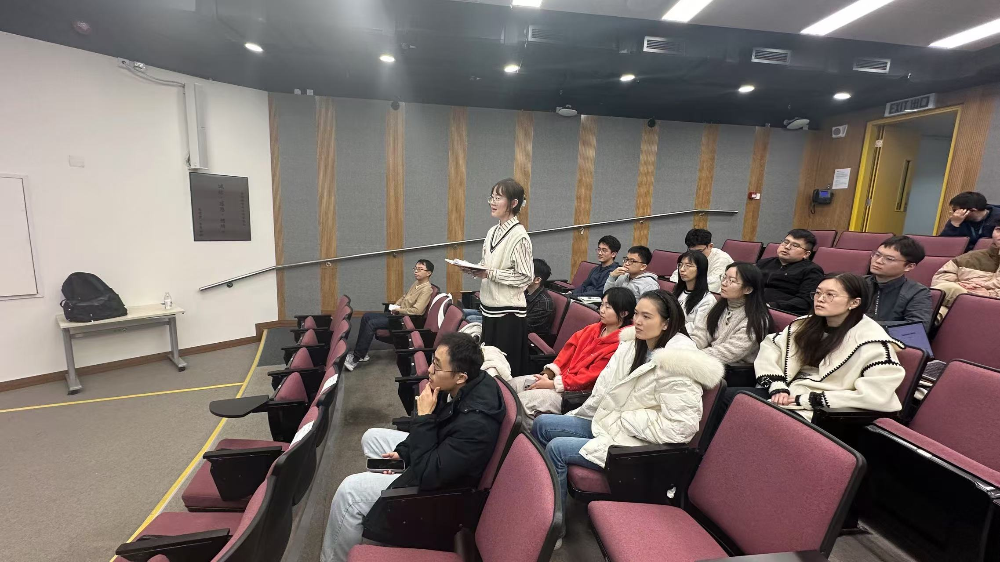
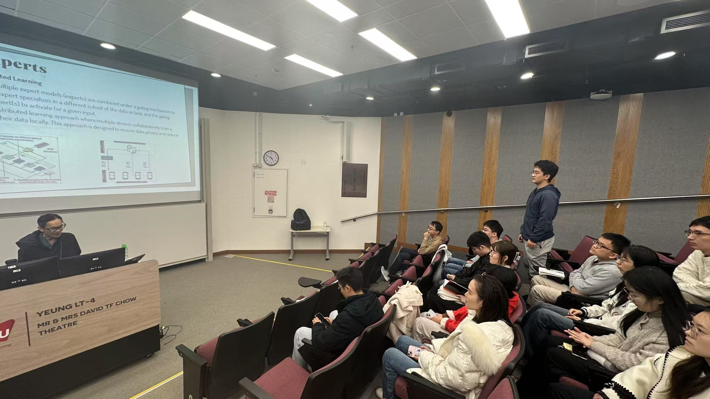

Speaker: **Prof. Dusit Niyato**. President's Chair Professor, College of Computing & Data Science (CCDS), Nanyang Technological University, Singapore
<!--more-->

## Abstract 

The evolution of generative artificial intelligence (GenAI) has driven revolutionary applications like ChatGPT. The proliferation of these applications is underpinned by the mixture of experts (MoE), which contains multiple experts and selectively engages them for each task to lower operation costs while maintaining performance. Despite MoE's efficiencies, GenAI still faces challenges in resource utilization when deployed on local user devices. Therefore, we first propose mobile edge networks supported MoE-based GenAI. Rigorously, we review the MoE from traditional AI and GenAI perspectives, scrutinizing its structure, principles, and applications. Next, we present a new framework for using MoE for GenAI services in Metaverse. Further, we propose a framework that transfers subtasks to devices in mobile edge networks, aiding GenAI model operation on user devices. Furthermore, we introduce a novel approach utilizing MoE, augmented with Large Language Models (LLMs), to effectively analyze user objectives and constraints of optimization problems based on deep reinforcement learning (DRL). This approach selects specialized DRL experts and weights each decision from the participating experts. In this process, the LLM acts as the gate network to oversee the expert models, facilitating a collective of experts to tackle a wide range of new tasks. Furthermore, it can also leverage LLM's advanced reasoning capabilities to manage the output of experts for joint decisions. Lastly, we insightfully identify research opportunities of MoE and mobile edge networks.

## Biography

Dr. Dusit Niyato is currently a President's Chair Professor in the College of Computing & Data Science (CCDS), Nanyang Technological University, Singapore. Dusit's research interests are in the areas of mobile generative AI, edge intelligence, quantum computing and networking, and incentive mechanism design. Currently, Dusit is serving as Editor-in-Chief of IEEE Communications Surveys and Tutorials (impact factor of 34.4 for 2023) and will serve as the Editor-in-Chief of IEEE Transactions on Network Science and Engineering (TNSE) from 2025. He is also an area editor of IEEE Transactions on Vehicular Technology (TVT), topical editor of IEEE Internet of Things Journal (IoTJ), lead series editor of IEEE Communications Magazine, and associate editor of IEEE Transactions on Wireless Communications (TWC), IEEE Transactions on Mobile Computing (TMC), IEEE Transactions on Information Forensics and Security (TIFS), and IEEE Transactions on Services Computing (TSC). Dusit is the Members-at-Large to the Board of Governors of IEEE Communications Society for 2024-2026. He was named the 2017-2023 highly cited researcher in computer science. He is a Fellow of IEEE and a Fellow of IET.

## Photos

