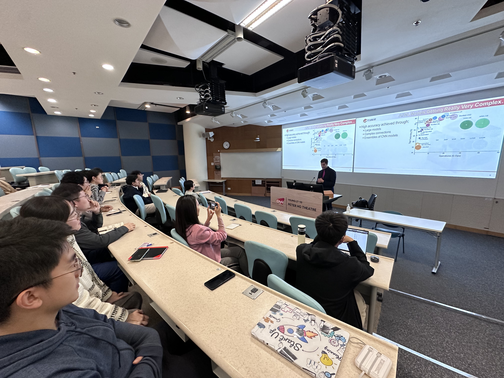
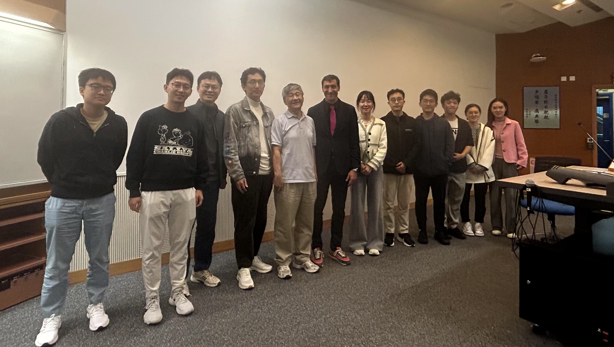

Speaker: **Prof. David Atienza**.
Professor of Electrical and Computer Engineering,
Associate Vice President of Research Centers and Platforms,
EPFL, Switzerland
<!--more-->

## Abstract 

Edge AI computing is targeting multiple domains nowadays, and a new set of complementary approaches have emerged as main avenues for designing novel accelerator-centric architectures for Cyber-Physical Systems (CPS) and wearable systems. The first approach is based on integrating enhanced general-purpose components in computing systems (such as adding computing capabilities in regular memory blocks, also called in-memory computing) as part of the micro-architecture of an edge AI system that comprises validated open hardware components (processors, memories, and peripherals). The second approach includes new accelerator modules inside the final edge AI architectures as a separate co-processing module of the target application domain, enabling new domain-specific heterogeneous system-on-chip (SoC) platforms. In this lecture, Prof. Atienza will cover the pros and cons of these two approaches, focusing on how to combine both based on recent research done within the X-HEEP open-hardware SoC architectural template. In particular, it will be shown how to integrate different families of accelerators, such as in-memory vs. near-memory acceleration or systolic arrays vs. Coarse-grained reconfigurable arrays (CGRA) to design the next generation of multi-parametric edge AI wearables targeting personalized healthcare.

## Biography

David Atienza is a professor of Electrical and Computer Engineering, heads the Embedded Systems Laboratory (ESL), and is the Associate Vice President of Research Centers and Platforms for the period of 2024-2028 at EPFL, Switzerland. His research interests include system-level design methodologies for multi-processor system-on-chip (MPSoC) targeting low-power Cyber-Physical Systems (CPS) and energy-efficient computing servers. His latest works include new 2.5D/3D power/thermal-aware design and architectures for MPSoCs targeting edge AI systems, as well as HW/SW co-design and AI-based multi-level optimization for sustainable computing in the Internet of Things (IoT) context.

Prof. David Atienza has co-authored over 450 papers, one book, and 14 patents in these previous areas. He has also received multiple recognitions and awards, among them the IEEE/ACM HW/SW Co-Design Conference (CODES-ISSS) 2024 Test-of-Time Award for the most influential paper in the last 15 years, the ICCAD 10-Year Retrospective Most Influential Paper Award in 2020, the Design Automation Conference (DAC) Under-40 Innovators Award in 2018, and IEEE CEDA and ACM SIGDA Early Career Awards on EDA tools and systems research. He is a Fellow of IEEE, Fellow of ACM, and has been the Chair of the European Design Automation Association (EDAA) since 2022 until 2024. He is currently the Editor-in-Chief of IEEE Trans. on CAD (T-CAD) and ACM Computing Surveys.
 

## Photos

