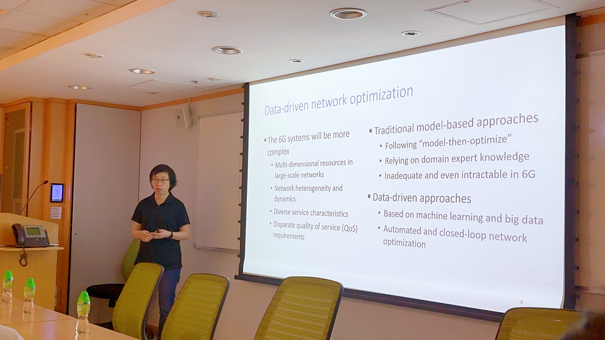
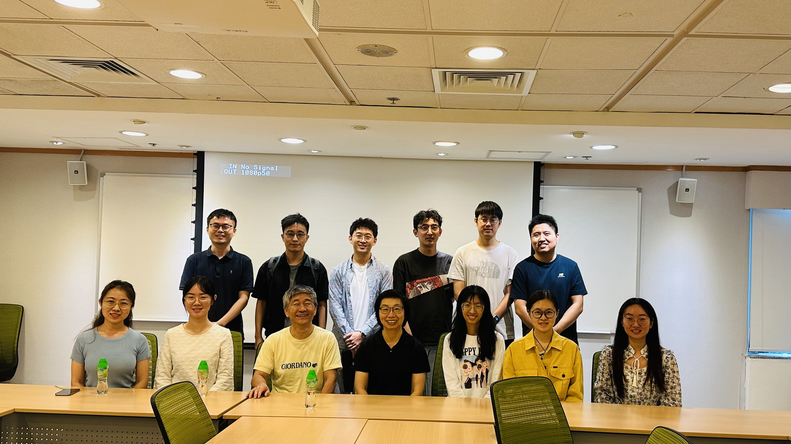

Speaker: **Prof Weihua Zhuang**.
Professor, University Professor, Tier I Canada Research Chair, Department of Electrical and Computer Engineering, University of Waterloo, Canada

<!--more-->

## Abstract 

Artificial intelligence models will continue to be pervasively deployed to support diverse intelligent Internet of Things (IoT) applications in the 5G/6G era. Many such applications rely on deep neural networks (DNN) for object classification. In this presentation, DNN inference uses a pre-trained DNN model to process an input data sample such as raw sensing data, and generates a classification result. We will discuss when to offload DNN inference computation from resource constrained IoT devices to the edge and how to incorporate different contributions from multiple random DNN inference results to improve task classification accuracy, while achieving high transmission, computation, and energy resource utilization.

## Biography

Weihua Zhuang is a University Professor and a Tier I Canada Research Chair in Wireless Communication Networks at University of Waterloo, Canada. Her research focuses on network architecture, algorithms and protocols, and service provisioning in future communication systems. She was the Editor-in-Chief of the IEEE Transactions on Vehicular Technology from 2007 to 2013, General Co-Chair of 2021 IEEE/CIC International Conference on Communications in China (ICCC), Technical Program Chair/Co-Chair of 2017/2016 IEEE VTC Fall, and Technical Program Symposia Chair of 2011 IEEE Globecom. She is an elected member of the Board of Governors and the President of the IEEE Vehicular Technology Society. Dr. Zhuang is a Fellow of the IEEE, Royal Society of Canada, Canadian Academy of Engineering, and Engineering Institute of Canada.

## Photos

